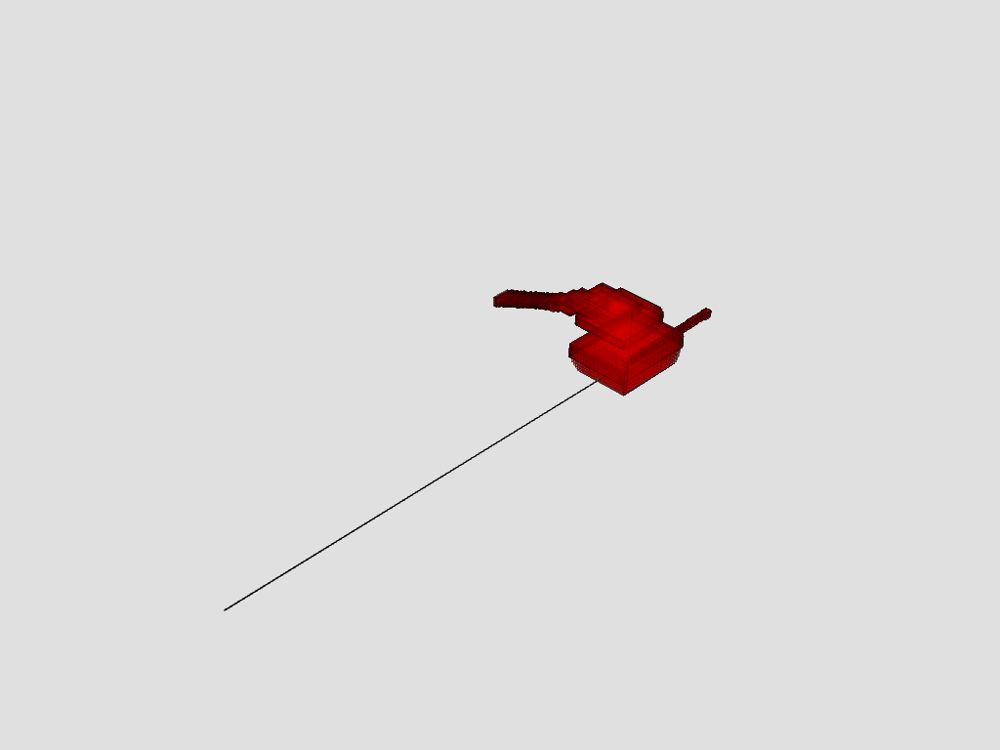

# Creating a Scenario
This is an informal introduction to creating scenarios in Verse. An interactive tutorial with more detailed instructions are provided in [this Jupyter notebook](https://github.com/AutoVerse-ai/Verse-library/blob/main/tutorial/tutorial.ipynb).

A Verse scenario is defined by a *map*, a set of *agents*, and optionally  a *sensor*. We will create a  scenario with a drone following a straight path and dodging obstacles by moving up or down.

## Instantiate Map
A *map* specifies the *tracks* or paths that the agents can follow. In this example, our map will have two types of tracks: 
    1. type <code>T0</code> is a straight x-axis aligned track 
    2. type <code>TAvoidUp</code> is a upward track for avoiding obstacles on the x-axis. 
Tracks types <code>T0</code> and <code>TAvoidUp</code> are called the *track modes* in a Verse model. Creating new maps is discussed in more detail in {doc}`Map<map>`. For now, import a pre-defined map with:

```python
from tutorial_map import M3

map1 = M3()
```

## Creating Agent
To create such a scenario in Verse, we first need to create an agent for Verse. An agent in Verse is defined by a set of tactical modes, a decision logic to determine the transition between tactical modes, and a flow function that defines continuous evolution. The agent's tactical mode and decision logic are provided as python code strings and the flow function is provided as a python function.

The tactical mode of the agents corresponds to an agent's decision. For example, in this drone avoidance example, the tactical mode for the agent can be <code>Normal</code> and <code>AvoidUp</code>. The decision logic also need to know the available track modes from the map. The tactical modes and track modes are provided as <code>Enums</code> to Verse.

```python
from enum import Enum, auto


class CraftMode(Enum):
    Normal = auto()
    AvoidUp = auto()


class TrackMode(Enum):
    T0 = auto()
    TAvoidUp = auto()
```

We also require the user to provide the continuous and discrete variables of the agents together with the decision logic. The variables are provided inside class with name <code>State</code>. Variables end with <code>_mode</code> will be identify by verse as discrete variables. In the example below, <code>craft_mode</code> and <code>track_mode</code> are the discrete variables and <code>x</code>, <code>y</code>, <code>z</code>, <code>vx</code>, <code>vy</code>, <code>vz</code> are the continuous variables. The type hints for the discrete variables are necessary to associate discrete variables with the tactical modes and lane modes defined above

```python
class State:
    x: float
    y: float
    z: float
    vx: float
    vy: float
    vz: float
    craft_mode: CraftMode
    track_mode: TrackMode
```

The decision logic describe for an agent takes as input its current state and the (observable) states of the other agents if there's any, and updates the tactical mode of the ego agent. In this example, the decision logic is straight forward: When the x position of the drone is close to the obstacle (20m), the drone will start moving upward. There's no other agents in this scenario. The decision logic of the agent can be written in an expressive subset of Python inside function <code>decisionLogic</code>.

```python
import copy

def decisionLogic(ego: State, track_map):
    next = copy.deepcopy(ego)
    if ego.craft_mode == CraftMode.Normal:
        if ego.x > 20:
            next.craft_mode = CraftMode.AvoidUp
            next.track_mode = track_map.h(ego.track_mode, ego.craft_mode, CraftMode.AvoidUp)
    return next
```

We incorporate the above definition of tactical modes and decision logic into code strings and combine it with an imported agent flow, we can then obtain the agent for this scenario.

```python
from tutorial_agent import DroneAgent

drone1 = DroneAgent("drone1", file_name="dl_sec1.py", t_v_pair=(1, 1), box_side=[0.4] * 3)
```

More details about how agents works in Verse are described in {doc}`Agents<agent>`

## Creating Scenario
With the agent and map defined, we can now define the scenario.

```python
from verse.scenario import Scenario

scenario = Scenario()
```

We can set the initial condition of the agent and add the agent

```python
drone1.set_initial(
    [[0, -0.5, -0.5, 0, 0, 0], [1, 0.5, 0.5, 0, 0, 0]], (CraftMode.Normal, TrackMode.T0)
)
scenario.add_agent(drone1)
```

and set the map for the scenario
```python
scenario.set_map(map1)
```

Since we only have one agent in the scenario, we don't need to specify a sensor.

We can then compute simulation traces or reachable states for the scenario
```python
traces_simu = scenario.simulate(60, 0.2)
traces_veri = scenario.verify(60, 0.2)
```

We can visualize the results using functions provided with Verse

```python
from verse.plotter.plotter3D import *
import pyvista as pv
import warnings

warnings.filterwarnings("ignore")
from verse.plotter.plotter2D import *
import plotly.graph_objects as go

fig = go.Figure()
fig = reachtube_tree(traces_veri, None, fig, 1, 3)
fig.show()

pv.set_jupyter_backend(None)
fig = pv.Plotter()
fig = plot3dMap(map1, ax=fig)
fig = plot3dReachtube(traces_veri, "drone1", 1, 2, 3, color="r", ax=fig)
fig.set_background("#e0e0e0")
fig.show()
```

The visualized result looks like

z vs t plot             |  x,y,z plot
:-------------------------:|:-------------------------:
     |  
